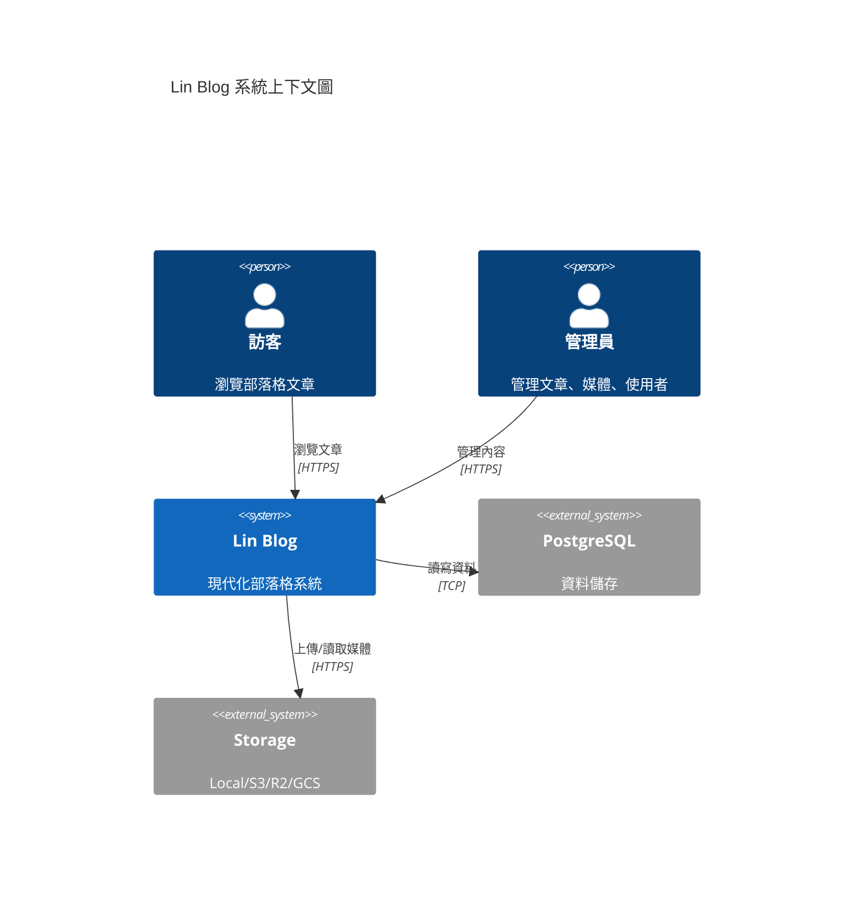
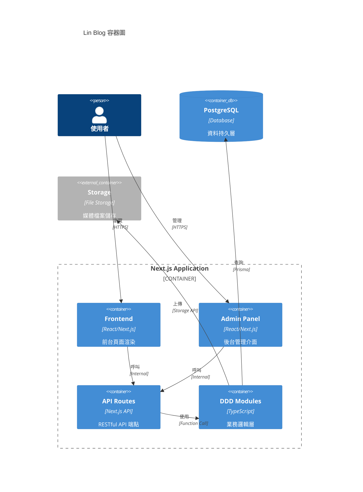
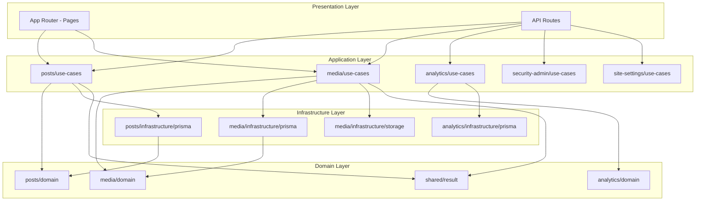

# 專案架構文件

本文件說明 Lin Blog 專案的整體架構設計。

## 技術棧

| 類別 | 技術 |
|------|------|
| **框架** | Next.js 15 (App Router) |
| **語言** | TypeScript |
| **資料庫** | PostgreSQL + Prisma ORM |
| **認證** | NextAuth.js v4 |
| **編輯器** | TipTap (WYSIWYG) |
| **樣式** | Tailwind CSS |
| **測試** | Vitest + Playwright |

---

## C4 Context Diagram

系統與外部使用者/系統的互動關係：



---

## C4 Container Diagram

系統內部的主要容器：



---

## DDD 模組依賴圖



---

## 分層架構

專案採用 **Clean Architecture** 四層分層：

### 1. Domain Layer（領域層）
- 位置：`src/modules/*/domain/`
- 職責：核心業務邏輯、領域模型、業務規則
- 限制：**不得依賴任何外部框架**

### 2. Application Layer（應用層）
- 位置：`src/modules/*/application/`
- 職責：Use Cases、業務流程編排
- 依賴：Domain Layer

### 3. Infrastructure Layer（基礎設施層）
- 位置：`src/modules/*/infrastructure/`
- 職責：資料庫存取、外部服務整合
- 依賴：Application Layer（實作 Ports）

### 4. Presentation Layer（展現層）
- 位置：`src/app/`、`src/components/`
- 職責：UI 渲染、API 路由
- 限制：**不得直接存取資料庫**

---

## 架構規則強制執行

透過 ESLint 強制執行分層規則：

```
UI 元件 ───X──→ Prisma/DB    (禁止)
App Router ───X──→ Prisma/DB  (禁止)
Domain ───X──→ Next.js        (禁止)
```

詳見 [.eslintrc.json](file:///e:/projects/lin_blog/web/.eslintrc.json)
